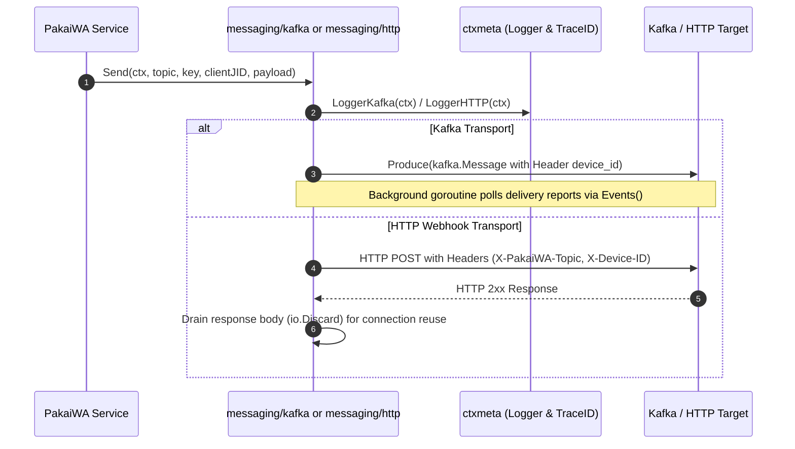

# Architecture Documentation: PakaiWA Platform

> **Status**: CONFIRMED (Derived directly from repository source code, manifests, and CI workflows)  
> **Role**: Shared Foundation Platform & Core Engineering Toolkit for PakaiWA Microservices Ecosystem

---

## 1. Component Architecture & Overview

PakaiWA Platform adalah fondasi pustaka terpusat (*shared platform library*) yang menyediakan abstraksi infrastruktur, messaging, observability, persistensi data, dan utilitas runtime untuk seluruh layanan backend PakaiWA.

```mermaid
graph TD
    subgraph Downstream["PakaiWA Microservices (API Gateway, Device Workers, Core Engine)"]
        SVC["Service Application (main)"]
    end

    subgraph PakaiWAPlatform["PakaiWA Platform Core Library"]
        subgraph NetLayer["Networking & Web"]
            FIBER["http/server/fiber (Fiber v3 Engine)"]
            CLIENT["http/client (Singleton HTTP Client)"]
        end

        subgraph MsgLayer["Event & Messaging Abstraction"]
            PROD_IF["messaging/producer (MessageProducer Interface)"]
            EVT_IF["messaging/event (Event Interface)"]
            KAFKA["messaging/kafka (Confluent Kafka Producer/Consumer)"]
            HTTP_WEBHOOK["messaging/http (HTTP Webhook Producer)"]
        end

        subgraph DataLayer["Persistence & State"]
            PG["db/postgres (pgxpool PostgreSQL)"]
            REDIS["cache/redis (go-redis v9)"]
        end

        subgraph CoreObs["Observability & Governance"]
            OBS_LOG["observability/logging (logrus Ordered JSON)"]
            OBS_CTX["observability/logging/ctxmeta (Scoped Loggers & TraceID)"]
            OBS_METRIC["observability/metrics (Prometheus Handler)"]
            VAL["validation (Validator v10 & Tag Resolver)"]
            SEC["security/password (Bcrypt Hashing)"]
            RT["runtime/shutdown (Signal Trap & Wait)"]
            ERR["errors (Must helper)"]
        end
    end

    subgraph ExternalInfra["External Infrastructure & Brokers"]
        PG_DB[("PostgreSQL 16+")]
        REDIS_NODE[("Redis 7+")]
        KAFKA_BROKER["Apache Kafka Cluster"]
        WEBHOOK_ENDPOINT["External Webhook Consumers"]
        PROM_SERVER["Prometheus Scraper"]
    end

    %% Wiring
    SVC --> FIBER
    SVC --> CLIENT
    SVC --> KAFKA
    SVC --> HTTP_WEBHOOK
    SVC --> PG
    SVC --> REDIS
    SVC --> RT
    SVC --> OBS_LOG

    KAFKA -.-> PROD_IF
    HTTP_WEBHOOK -.-> PROD_IF
    KAFKA -.-> EVT_IF

    PG --> PG_DB
    REDIS --> REDIS_NODE
    KAFKA --> KAFKA_BROKER
    HTTP_WEBHOOK --> WEBHOOK_ENDPOINT
    FIBER --> PROM_SERVER
```



---

## 2. Request & Data Flow

### 2.1 Inbound HTTP & Observability Pipeline
1. **Server Bootstrap**: Service memanggil [`httpserver.NewFiber(opts)`](file:///Users/i/work/PakaiWA/pakaiwa-platform/http/server/fiber/fiber.go#L29) dengan proteksi proxy reverse default (`TrustProxy: true`, `EnableIPValidation: true`).
2. **Context Logging**: Middleware menginjeksikan Trace ID dan domain logger (`LoggerHTTP`, `LoggerDB`, dll.) ke dalam standard `context.Context` menggunakan [`ctxmeta.WithLoggers`](file:///Users/i/work/PakaiWA/pakaiwa-platform/observability/logging/ctxmeta/logger.go#L42).
3. **Validation**: Request body divalidasi via [`validation.NewValidator()`](file:///Users/i/work/PakaiWA/pakaiwa-platform/validation/validator.go#L25); kegagalan divalidasi dan dicatat melalui [`LogValidationErrors`](file:///Users/i/work/PakaiWA/pakaiwa-platform/validation/validator_logging.go#L29) dengan structured tags.
4. **Metrics Exporting**: Prometheus scraper mengakses `/metrics` yang dilayani oleh [`metrics.PrometheusHandler()`](file:///Users/i/work/PakaiWA/pakaiwa-platform/observability/metrics/prometheus.go#L51).

### 2.2 Outbound Event Streaming & Webhook Dispatch


---

## 3. Concurrency & Resource Management

- **Database Connection Pooling**:
  - Implementasi via `pgxpool.Pool` di [`db/postgres/pgsql.go`](file:///Users/i/work/PakaiWA/pakaiwa-platform/db/postgres/pgsql.go#L28).
  - Mengelola batas konkurensi koneksi melalui `MinConns`, `MaxConns`, `MaxConnLifetime`, dan `MaxConnIdleTime`.
  - Fail-fast validation saat bootstrap: `MinConns > MaxConns` langsung menghasilkan error.
- **Kafka Background Poll Loop**:
  - Dikelola oleh [`StartProducerPollLoop`](file:///Users/i/work/PakaiWA/pakaiwa-platform/messaging/kafka/producer.go#L123) dalam goroutine terpisah.
  - Memproses `<-kp.Events()` secara non-blocking hingga `ctx.Done()` diterima.
- **HTTP Client Singleton**:
  - Dikelola via `sync.Once` di [`http/client/client.go`](file:///Users/i/work/PakaiWA/pakaiwa-platform/http/client/client.go#L30) untuk memastikan efisiensi pool koneksi TCP/Keep-Alive.
- **OS Signal Trap**:
  - [`runtime/shutdown.Wait(ctx, sigs...)`](file:///Users/i/work/PakaiWA/pakaiwa-platform/runtime/shutdown/signal.go#L31) mengamankan channel signal buffered (`chan os.Signal, 1`) untuk mengantisipasi `SIGINT` dan `SIGTERM` secara graceful tanpa goroutine leak.

---

## 4. Error Handling & Fault Tolerance

- **Fail-Fast Initialization**:
  - Fungsi generik [`errors.Must[T](v, err)`](file:///Users/i/work/PakaiWA/pakaiwa-platform/errors/panic.go#L21) digunakan khusus pada startup service (misal parsing konfigurasi/koneksi awal) di mana service tidak boleh berjalan dalam kondisi cacat.
- **Circuit / Buffer Overflow Handling**:
  - Pada `KafkaProducer.Send`, saat error berupa `kafka.ErrQueueFull`, error diexpose kembali ke caller agar caller dapat menentukan kebijakan retry atau backoff.
- **HTTP Webhook Connection Hygiene**:
  - Pada [`messaging/http/producer.go`](file:///Users/i/work/PakaiWA/pakaiwa-platform/messaging/http/producer.go#L104), response body selalu di-drain menggunakan `io.Copy(io.Discard, resp.Body)` dan ditutup untuk mencegah kebocoran soket file descriptor dan memastikan koneksi HTTP keep-alive dapat digunakan kembali.

---

## 5. Observability & Telemetry

### 5.1 Structured Logging (`observability/logging`)
- **Ordered JSON Formatter**: [`OrderedJSONFormatter`](file:///Users/i/work/PakaiWA/pakaiwa-platform/observability/logging/logrus/logger.go#L34) menghasilkan JSON log dengan urutan kunci terstandarisasi:
  ```json
  {"time":"...","level":"info","trace_id":"...","msg":"...","caller":"pgsql.go:91", ...data, "module":"..."}
  ```
- **Domain-Scoped Loggers**: Logger dipisahkan berdasarkan domain operasional:
  - `app`: Aplikasi umum
  - `db`: Database queries dan pool lifecycle
  - `http`: Ingress & egress HTTP
  - `kafka`: Event streaming publish & delivery reports
  - `wa`: WhatsApp protocol engine & session events
- **Caller Tracking**: [`resolveCaller()`](file:///Users/i/work/PakaiWA/pakaiwa-platform/observability/logging/logrus/logger.go#L263) secara cerdas melewati frame logrus internal dan wrapper untuk menampilkan file & line sebenarnya dari caller.

### 5.2 Metrics (`observability/metrics`)
- Mendefinisikan counter global `http_requests_total` (`method`, `path`, `status`) dan histogram `http_request_duration_seconds` (`method`, `path`).

---

## 6. Data & Domain Boundaries

- **Agnostic Event Contracts**:
  - Domain event didefinisikan lewat interface [`event.Event`](file:///Users/i/work/PakaiWA/pakaiwa-platform/messaging/event/event.go#L18). Komponen pengirim tidak perlu mengetahui implementasi konkret Kafka maupun Webhook HTTP.
- **Client JID / Device Routing**:
  - Di seluruh pipeline messaging, identifier WhatsApp (`clientJID` / `device_id`) diperlakukan sebagai metadata routing utama (disuntikkan pada Kafka Header `device_id` atau HTTP Header `X-Device-ID`).
- **Credential Separation**:
  - Field kredensial seperti Redis password secara ketat dianotasi dengan `json:"-"` guna mencegah kebocoran log.
